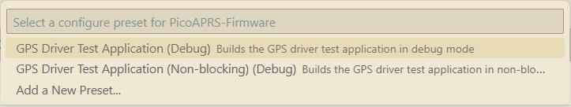
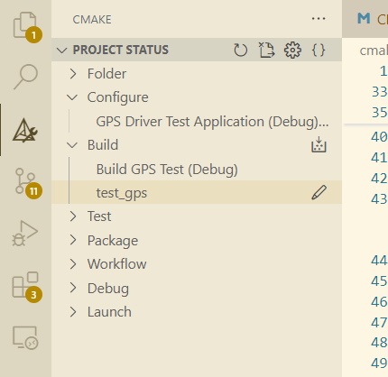

# CMake Presets for PicoAPRS Firmware

This document describes the CMake presets system used in the PicoAPRS Firmware project and how to use it with the VS Code CMake Tools extension. CMake Presets give us a seemless way to share common
configuration and build settings that can be shared in a version control system (i.e. git/GitHub).

## Overview

The project uses CMake presets to provide a convenient way to configure and build different variants of the firmware and various test apps. Presets allow us to:

- Define common build configurations (Debug, Release, etc.)
- Set target-specific variables (MCU, linker script, etc.)
- Create specialized test applications

## Preset Structure

The preset system is organized into several files:

- `CMakePresets.json` - Root preset file that includes other preset files and defines build targets
- `cmake/presets/base-presets.json` - Common build configurations (Debug, Release, etc.)
- `cmake/presets/l432kc-presets.json` - Target-specific configurations for STM32L432KC MCU

**Note**: It is generally recommend that presets in the `cmake/presets/**` folder use the `hidden` attribute as these presets are meant to be inherited by other presets and not directly selected on their own.

### Required Configuration Variables

The build system requires the following variables to be defined:

- `LINKER_SCRIPT` - Path to the linker script for the target
- `CUBEMX_PATH` - Path to the STM32CubeMX generated code

These variables are set in the target-specific preset files.

## Using CMake Tools in VS Code

### Setup

1. Install the CMake Tools extension for VS Code
2. Open the PicoAPRS-Firmware project in VS Code
3. The extension should automatically detect the CMake presets

### Selecting a Build Configuration

1. Click on the "Select a configure preset" button in the VS Code status bar (or use Ctrl+Shift+P and search for "CMake: Select Configure Preset"). Alternatively, you can select the CMake extension from the left panel in VS Code.
2. Choose one of the available presets. At the time of writing this these are:
   - `GPS Driver Test Application (Debug)`
   - `GPS Driver Test Application (Non-blocking) (Debug)`



### Building the Project

After selecting a preset make sure to also specify the correct build target if this isn't done automatically.
1. Click on the CMake extension from the left panel
2. Click the Build drop down and ensure the build target is set



### Creating a New Build Configuration

To create a new build configuration:

1. Create a new preset in `CMakePresets.json` by adding a new entry in the `configurePresets` array
2. Inherit from the appropriate base presets
3. Set any specific cache variables needed for your configuration

Example:

```json
{
  "name": "test-your-feature-debug",
  "displayName": "Your Feature Test (Debug)",
  "description": "Builds your feature test in debug mode",
  "inherits": ["Debug", "l432kc-base"],
  "binaryDir": "${sourceDir}/build/${presetName}",
  "cacheVariables": {
    "BUILD_TEST_YOUR_FEATURE": "ON"
  }
}
```

4. Add a corresponding entry in the `buildPresets` array:

```json
{
  "name": "test-your-feature-debug",
  "displayName": "Build Your Feature Test (Debug)",
  "configurePreset": "test-your-feature-debug"
}
```

## Common Tasks

### Debugging
The project includes VS Code tasks that integrate with the CMake Tools extension to simplify debugging. To get the launch.json and tasks.json files be sure you've correctly setup the STM32
extension and imported a CMake project. These json files will use variables such as this `"executable": "${command:cmake.launchTargetPath}"`, and this `"${command:cmake.launchTargetPath}"` which integrate direclty with the cmake extension and give you some flexibility of reusing these tasks for various targets.

1. Select a Debug preset using the CMake Tools configure preset selector
2. Build the project
3. Start a debug session


### Adding a New Target

1. Create a new target folder under `targets/` with the MCU family and specific chip
2. Add a new preset file in `cmake/presets/` (e.g., `your-mcu-presets.json`)
3. Include this file in the root `CMakePresets.json`
4. Define the target-specific variables in your preset file

## Troubleshooting

- If you encounter errors about missing variables like `LINKER_SCRIPT` or `CUBEMX_PATH`, ensure you:

1. Selected a valid configure preset before building
2. Have properly defined these variables in your target preset file
3. Included all necessary preset files in the root `CMakePresets.json`

For more details on CMake presets, see the [official CMake documentation](https://cmake.org/cmake/help/latest/manual/cmake-presets.7.html).

- If you encounter stm32cubemx errors about multiple inclusions, its likely that you've added a compile definition that is causing multiple target mcu's to include symbols you don't want. Note that the cubemx library is built with these compile defintions:

```
target_compile_definitions(stm32cubemx INTERFACE
	USE_HAL_DRIVER
	STM32L432xx
    $<$<CONFIG:Debug>:DEBUG>
)
```
**DO NOT** add compile definitions that conflict with which cubemx mcu you are compiling for. This will mess up header guards and cause those duplicate symbol definitions.
