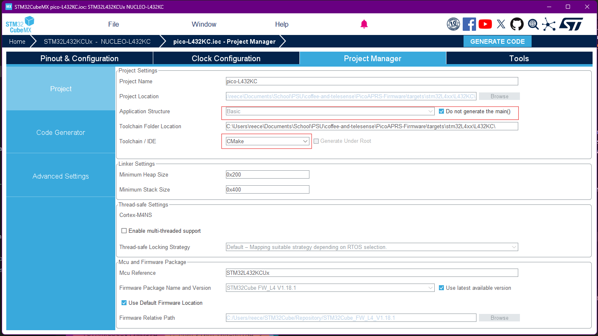
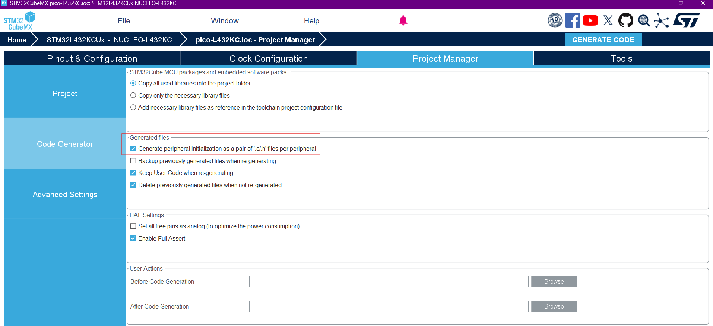

# Contributing Guide
**Authors Note**: This is a very primitive guide and will likely undergo significant changes. 

## Project Structure Rationale
This project uses a structure that is intended to support multiple MCU targets and sensor drivers because of the obvious reason that many of us are working on different nucleo boards and sensors. The build system at this point is still under development and `TBD`. With that said, outlined here is a general setup to get working on your specific target board and/or sensor with minimal setup and headache (no promises). To do this we will be using CMake, and the CMake files generated by the stm32cubemx.

Thankfully for us, stm32cubemx generates code with the assumption that its creating a stand-alone project. We can leverage this by simply creating a CMake file that properly brings in the `INTERFACE` library that cubemx has nicely provided us (you can read more on libraries [here](https://cliutils.gitlab.io/modern-cmake/chapters/basics.html)). The CMake source of any cubemx library can be found in `cmake/stm32cubemx/CMakeLists.txt` of a generated stm32cubemx project. 

An `INTERFACE` library in CMake is special because it:
- Doesn't produce any compiled output itself
- Packages together all compilation requirements (include paths, definitions, source files)
- Automatically propagates these requirements to any target that links against it
- Makes it easy to reuse the same MCU setup across multiple executables

This means we can create multiple test executables or applications that all share the same MCU configuration by simply linking them to the INTERFACE library. If that doesn't make sense this [video](https://www.youtube.com/watch?v=ARZd-fSUJXY&ab_channel=LearnQtGuide) nicely explains these concepts. You could also ignore these concepts and follow this guide on setting up cmake as it should be straightforward from here.

Lastly, we are creating projects in the form of tests because we are early in the development and at this point the final application we build will likely look much different then our collective indiviual work. Quite a bit of integration and build tooling will need to setup to support multiple targets. If we decide on a single stm32 target this will of course be much easier to manage. 

## Creating a target and test executable from CMake
These are the general steps to getting up and running, but first make sure you are comfortable with cubemx and the CMake files it generates when selecting the CMake file option:
1. Check to see if the files are already generated for your target in the `targets/` directory. 
- If they aren't generated yet use stm32cubemx to generate these file. **Be sure to follow the current directory structure and naming conventions.** 
- **IMPORTANT** When using stm32cubemx make sure these options are all selected before generating your code. 

- **IMPORTANT** Then under the Code Generator tab on the left select these options. 



2. Once code is generated, create a specific tests directory for what you are developing. For example, I've been working on the gps module so I've created `tests/tests_gps`. 
3. Once your directory is setup you will need five things: 1) A `main()` entry point (since we told cubemx not to generate main()), 2) A CMakeLists.txt file, and 3) A CMakePresets.json file, 4) Fix a bug in the stm32 main.h file, 5) Edit the toolchain file. 
- I've provided templates for the files you will need. 


### 1. CMakeLists.txt Template
Copy and paste this to your tests directory and complete the `FIXME` sections 
```cmake
cmake_minimum_required(VERSION 3.22)

# Setup compiler settings
set(CMAKE_C_STANDARD 11)
set(CMAKE_C_STANDARD_REQUIRED ON)
set(CMAKE_C_EXTENSIONS ON)

# Define the build type
if(NOT CMAKE_BUILD_TYPE)
    set(CMAKE_BUILD_TYPE "Debug")
endif()

# FIXME: Change name as necessary
set(CMAKE_PROJECT_NAME test_gps)

# User sets this to the target MCU
# Example: set(MCU_TARGET_PATH ${CMAKE_SOURCE_DIR}/../../targets/stm32L4xx/L432KC/cmake)
# FIXME:
set(MCU_TARGET_PATH ${CMAKE_SOURCE_DIR}/../../targets/some/target/)

# User sets this to the target MCU, useful for compile definitions
# Example: add_compile_definitions(TARGET_MCU=STM32L432KC)
# FIXME (optional):
add_compile_definitions(TARGET_MCU=STM32L432KC)

# Set the linker script path variable which will be available to the toolchain file generated by cubemx
set(LINKER_SCRIPT_PATH "${MCU_TARGET_PATH}/stm32l432kcux_flash.ld" CACHE STRING "Path to linker script")

# Include the target's toolchain file
include(${MCU_TARGET_PATH}/gcc-arm-none-eabi.cmake)

# Enable compile command to ease indexing with e.g. clangd
set(CMAKE_EXPORT_COMPILE_COMMANDS TRUE)


project(${CMAKE_PROJECT_NAME} VERSION 1.0
                  DESCRIPTION "Test GPS project"
                  LANGUAGES C CXX ASM
)  

message("Build type: " ${CMAKE_BUILD_TYPE})

# Create an executable object type
add_executable(${CMAKE_PROJECT_NAME})

# Add test sources
target_sources(${CMAKE_PROJECT_NAME} PRIVATE
    # Add user sources here
    # Example: ${CMAKE_SOURCE_DIR}/test_gps.c
)

# Add include paths
target_include_directories(${CMAKE_PROJECT_NAME} PRIVATE
    # Add user defined include paths here
    # Example: ${CMAKE_SOURCE_DIR}/../../Src/Sensors/Inc
)

# Add project symbols (macros)
target_compile_definitions(${CMAKE_PROJECT_NAME} PRIVATE
    # Add user defined symbols for local scope to target executable
)

# Add STM32CubeMX generated sources
add_subdirectory(
    ${MCU_TARGET_PATH}/stm32cubemx             # Source directory
    ${CMAKE_BINARY_DIR}/stm32cubemx       # Binary directory
)

target_link_libraries(${CMAKE_PROJECT_NAME} 
    stm32cubemx
)
```
This [CMakeLists.txt](../tests/test_gps/CMakeLists.txt) is a fully functioning example

### 2. CMakePresets.json
Copy and paste this but fix the `toolchainFile` line
```cmake
{
    "version": 3,
    "configurePresets": [
        {
            "name": "default",
            "hidden": true,
            "generator": "Ninja",
            "binaryDir": "${sourceDir}/build/${presetName}",
		    "toolchainFile": "${sourceDir}/../../targets/stm32L4xx/L432KC/cmake/gcc-arm-none-eabi.cmake",
            "cacheVariables": {
            }
        },
        {
            "name": "Debug",
            "inherits": "default",
            "cacheVariables": {
                "CMAKE_BUILD_TYPE": "Debug"
            }
        },
        {
            "name": "RelWithDebInfo",
            "inherits": "default",
            "cacheVariables": {
                "CMAKE_BUILD_TYPE": "RelWithDebInfo"
            }
        },
        {
            "name": "Release",
            "inherits": "default",
            "cacheVariables": {
                "CMAKE_BUILD_TYPE": "Release"
            }
        },
        {
            "name": "MinSizeRel",
            "inherits": "default",
            "cacheVariables": {
                "CMAKE_BUILD_TYPE": "MinSizeRel"
            }
        },
        {
            "name": "target-base",
            "hidden": true,
            "inherits": "default"
        }
    ],
    "buildPresets": [
        {
            "name": "Debug",
            "configurePreset": "Debug"
        },
        {
            "name": "RelWithDebInfo",
            "configurePreset": "RelWithDebInfo"
        },
        {
            "name": "Release",
            "configurePreset": "Release"
        },
        {
            "name": "MinSizeRel",
            "configurePreset": "MinSizeRel"
        }
    ]
}
```

### 3. Getting to `main()`
Here's a skeleton main template, your target very well might need a different setup especially if you have other perihperals. 
```c
// Gets us the peripheral handles and pin definitions from cubemx generated code
#include "main.h"     // For HAL definitions and Error_Handler
#include "gpio.h"     // For GPIO functions
#include "i2c.h"      // For I2C functions
#include "usart.h"    // For UART functions
#include "test_gps.h" // 

int main(void)
{
  /* MCU Configuration--------------------------------------------------------*/

  /* Reset of all peripherals, Initializes the Flash interface and the Systick. */
  HAL_Init();

  /* Configure the system clock */
  SystemClock_Config();

  /* Initialize all configured peripherals */
  MX_GPIO_Init();
  MX_I2C1_Init();
  MX_USART1_UART_Init();
  MX_USART2_UART_Init();

  /* Your test code here */
  while (1)
  {
    // Test loop
    HAL_Delay(1000);
  }
}

```

### 4. main.h bug fix
Simply go to the target directory you've generated code for. Find the main.h file, its likely in a similar path to this `targets/L432KC/Inc/main.h`
- Add the following line as shown below
```c
/* Exported functions prototypes ---------------------------------------------*/
void Error_Handler(void);
//Add this line below: void SystemClock_Config(void);
void SystemClock_Config(void);
```

### 5. Edit the toolchain file -> `gcc-arm-none-eabi.cmake`
- Its generated under the `cmake` folder of the target your working with
- Comment our the linker (.ld) section, and fix it up to work with our project structure as shown below
```cmake
#set(CMAKE_C_LINK_FLAGS "${CMAKE_C_LINK_FLAGS} -T \"${CMAKE_SOURCE_DIR}/stm32l432kcux_flash.ld\"")
set(CMAKE_C_LINK_FLAGS "${CMAKE_C_LINK_FLAGS} -T \"${LINKER_SCRIPT_PATH}\"")
```
- **Note**: This works because if you notice in the CMake template I provided we have defined a cached variable called `LINKER_SCRIPT_PATH`, which because its cache, it has a global scope that allows other CMake files to use this as well. 


## Building Your Test Project
You should be able to build and compile your project now. 
```bash
# From your test directory
cmake --preset Debug
cmake --build build/Debug
```

## Common Issues and Solutions
TODO: Add issues here as they come up.